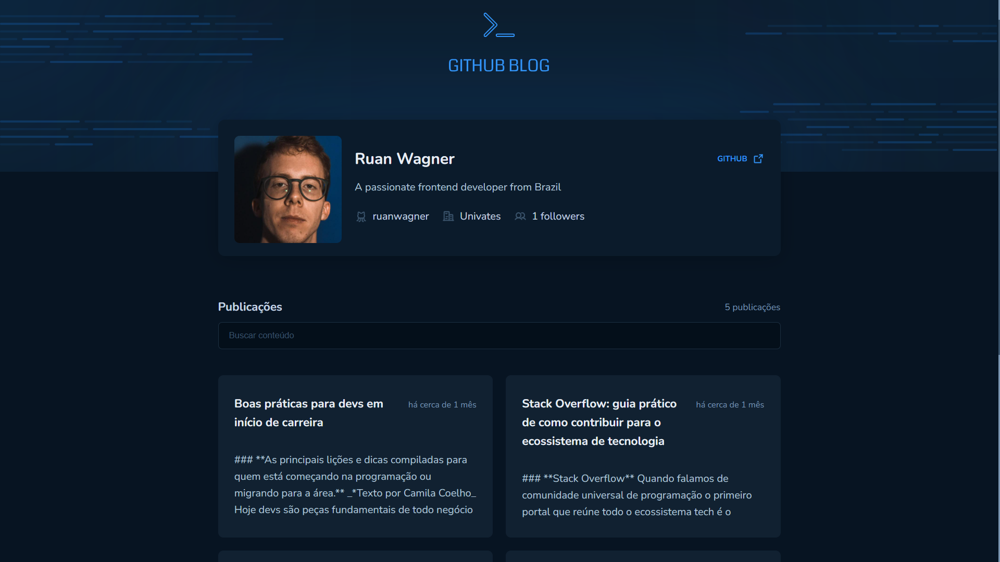
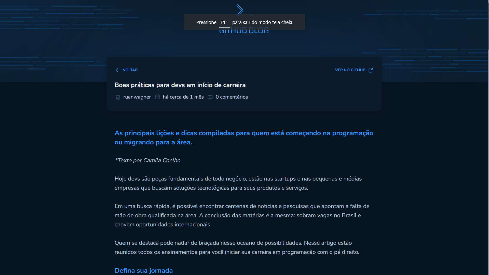

<p align="center">
  

  
  
  <a href="https://github.com/ruanwagner/github-blog-rocketseat/commits/master">
    
  </a>
    
   
   <a href="https://github.com/ruanwagner/github-blog-rocketseat/stargazers">
    
  </a>
</p>

<h1 align="center"> 
	GITHUB BLOG
</h1>

<p align="center">
 <a href="#-about">About</a> •
 <a href="#-functionalities">Functionalities</a> •
 <a href="#-layout">Layout</a> • 
 <a href="#-executing">Executing</a> • 
 <a href="#-tools">Tools</a> • 
 <a href="#-author">Author</a> • 
 <a href="#-license">License</a>
</p>


## 💻 About

Gihub Blog - it's an ideia of blog that brings a list of issues posts of a repository in the github user account

Github api consumption
List and filter posts

Project developed as a challenge in the Ignite course of Rocketseat [Rocketseat](https://blog.rocketseat.com.br).

---

## ⚙️ Functionalities

- [x] Show a list of posts of the user
- [x] Filter the posts by typing something in the search field
- [x] Open the entire post in a page
- [x] Uses the **[Github's api](https://docs.github.com/pt/rest/users/users?apiVersion=2022-11-28#get-a-user)** to get the posts with axios

---

## 🎨 Layout

App layout desing is available on Figma:

<a href="https://www.figma.com/community/file/1138814951106121051/GitHub-Blog">
  
</a>

### Web

<p align="center" style="display: flex; align-items: flex-start; justify-content: center;">
  

  
</p>

---

## 🚀 Executing

### Pre-requirements

[Git](https://git-scm.com)
[Node.js](https://nodejs.org/en/). 
[VSCode](https://code.visualstudio.com/)


#### 🧭 Running the web application (frontend)

```bash

# clone this repository
$ git clone git@github.com:ruanwagner/github-blog-rocketseat.git

# open the directory of the project in a terminal
$ cd github-blog-rocketseat

# install the dependecies
$ npm install

# run in development mode
$ npm run dev

# the app will opne at the port:5173 - access http://localhost:5173

```

---

## 🛠 Tools

The following tools were used in building the project:

#### **Website**  ([React](https://reactjs.org/)  +  [TypeScript](https://www.typescriptlang.org/))

-   **[Phosphor Icons](https://phosphoricons.com/)**
-   **[Axios](https://github.com/axios/axios)**
-   **[styled-components](https://styled-components.com/)**
-   **[react-markdown](https://github.com/remarkjs/react-markdown)**
-   **[date-fns](https://github.com/date-fns/date-fns)**

> See the file  [package.json](https://github.com/ruanwagner/github-blog-rocketseat/blob/master/package.json)

#### **Utilities**

-   **[ESLint](https://github.com/eslint/eslint)**

---

## 🦸 Author

<a href="#">
 
 <br />
 <sub><b>Ruan Wagner</b></sub></a> 
 <br />

[Contact-me!]()

<br />

[](https://www.linkedin.com/in/ruanwagner/) 
[](mailto:ruan.wagner@universo.univates.br)

---

## 📝 License

This project is licensed [MIT](./LICENSE).

Made with ❤️ by Ruan Wagner ✌ 

---
